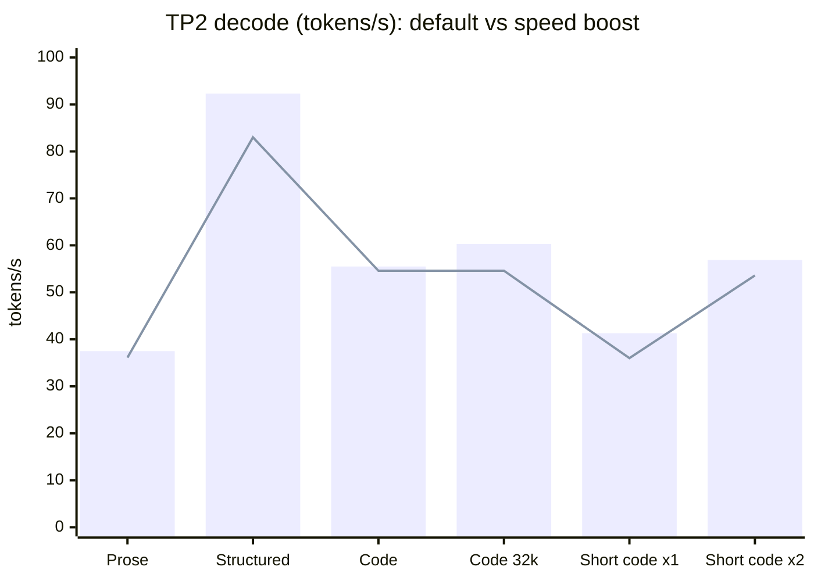

<p align="center">
  
</p>

<h1 align="center">GLM-5.3 Flash EXL3 on DGX Spark</h1>

<p align="center">
  <b>Serve GLM-5.3 Flash on 2, 3 or 4 NVIDIA DGX Sparks with one command.</b><br>
  <sub>by <a href="https://x.com/MiaAI_lab">Mia's AI Lab</a> and the community</sub>
</p>

<p align="center">
  
  
  
  
  
</p>

<p align="center">
  <a href="https://github.com/sponsors/MiaAI-Lab"></a>
  <a href="https://x.com/MiaAI_lab"></a>
</p>

An OpenAI-compatible vLLM server for
[zai-org/GLM-5.3-Flash](https://huggingface.co/zai-org/GLM-5.3-Flash), using
4-bpw EXL3 weights, fp8 KV cache and DFlash2 speculative decoding, built
natively for the GB10 (`sm_121a`). The launcher pulls the image, downloads
the weights, shares them with the other Sparks and starts the cluster.

| I want to... | Go to |
|---|---|
| Run it on two Sparks | [Quick start](#quick-start) |
| See how fast it is | [Performance](#performance) |
| Get more speed | [Speed boost](#tp2-profiles)  |
| Serve an abliterated model | [Abliteration](#tp2-profiles)  |
| Use 3 or 4 Sparks | [Topologies](#topologies) |
| Change a setting | [Configuration](#configuration) |
| Find every knob, receipt and caveat | [Full reference](docs/REFERENCE.md) |

## At a glance

| | |
|---|---|
| **Model id** | `GLM-5.3-Flash-EXL3` on `http://<head>:8888/v1` |
| **Weights** | [Mia-AiLab/GLM-5.3-Flash-EXL3-TR3-4bpw](https://huggingface.co/Mia-AiLab/GLM-5.3-Flash-EXL3-TR3-4bpw), EXL3 TR3 4 bpw, ~164 GiB |
| **Speculative decoding** | [DFlash2](https://huggingface.co/incoai/GLM-5.3-Flash-DFlash2), 7 draft tokens |
| **Context** | 850k tokens by default; 1.23M-token KV pool (1.45× one full request) |
| **Features** | Tool calling, reasoning, image and video input, prefix caching, optional API key |
| **Image** | `ghcr.io/miaai-lab/glm-5.3-flash-2x-dgx-sparks:exl3-instanttensor` (public) |

## Quick start

On the head Spark, with the second Spark reachable over SSH and the CX7 cable connected:

```bash
git clone https://github.com/MiaAI-Lab/GLM-5.3-Flash-EXL3-2x-DGX-Sparks.git
cd GLM-5.3-Flash-EXL3-2x-DGX-Sparks
cp .env.example .env     # set HEAD_IP, WORKER_IP and the CX7 interface names
./start.sh               # pull, download, share weights, start, warm up
```

The first start downloads ~164 GiB and takes a while. When it prints
**`GLM-5.3-Flash EXL3 is UP`**, send a request:

```bash
curl -s http://127.0.0.1:8888/v1/chat/completions -H 'Content-Type: application/json' \
  -d '{"model": "GLM-5.3-Flash-EXL3", "messages": [{"role": "user", "content": "Hello!"}]}'
```

| Command | Does |
|---|---|
| `./start.sh status` | Show the cluster state |
| `./start.sh logs` / `logs worker` | Follow the head or worker logs |
| `./start.sh restart` | Apply `.env` changes |
| `./start.sh stop` | Stop both Sparks |

> [!NOTE]
> After a `git pull` that changes the image recipe, the next start rebuilds the
> image once. That is expected.

Network setup, NFS weight sharing, air-gapped installs and other kits:
[Quick start reference](docs/REFERENCE.md#quick-start-2-spark) ·
[Running on a different kit](docs/REFERENCE.md#running-on-a-different-2spark-kit).

## Performance

Latest TP2 measurements on 2× GB10, 2026-09-28: DFlash2, temperature 0,
thinking off, mean of fresh boots. Decode excludes time to first token.

> [!IMPORTANT]
> **Default** is what every install gets. **Speed boost** is opt-in: one
> `.env` line and a one-time ~25 min build on the head. See
> [TP2 profiles](#tp2-profiles).

| Decode, tokens/s | Default | Speed boost | Change |
|---|---:|---:|---:|
| Prose | 36.1 | 37.5 | +4% |
| Structured output | 83.0 | 92.3 | +11% |
| Code | 54.6 | 55.5 | +2% |
| Code at 32k context | 54.6 | 60.3 | +10% |
| Short code, 1 request | 36.0 | 41.3 | +15% |
| Short code, 2 requests (total) | 53.6 | 56.9 | +6% |



<sub>Bars: speed boost. Line: default.</sub>

| Cold prefill, tokens/s | 8k | 32k | 96k |
|---|---:|---:|---:|
| Default | 1,411 | 1,511 | 1,498 |
| Speed boost | 1,390 | 1,500 | 1,489 |

**Recent gains**

- **Default, 2026-09-26:** decode 3.9–5.2% faster and 16k/64k time to first
  token 11.5–12.6% lower than the previous default, with the same weights and
  a numerics check that found no quality loss.
  ([finding](docs/adopt-fp8-all-kda-bf16-2026-09-26.md))
- **4× Spark, 2026-09-27:** faster prefill is now on by default: 1,772 /
  2,422 / 2,733 tokens/s cold prefill at 8k / 32k / 100k, up from 1,316 /
  1,761 / 1,940 (contributor measurement).
- **Abliteration + speed boost, 2026-09-30:** decode 34.97 / 82.84 / 51.28
  tokens/s (prose / structured / code) against 34.87 / 80.68 / 46.54 for
  plain abliteration: up to +10%, one boot per arm.

> [!NOTE]
> Speed-boost figures come from 2–3 boots per arm with unlocked clocks;
> treat them as descriptive, not confidence intervals. Methods, raw receipts
> and older tables: [Performance history](docs/REFERENCE.md#cold-prefill-e3-grouped-moe-this-kit-2026-09-07).

## TP2 profiles

Pick one per start. All run on the same public base weights.

| Profile | Turn on | Best for | Notes |
|---|---|---|---|
| **Default**  | nothing | Everyone | FP8 dense layers, BF16 prefill path |
| **Speed boost**  | `GLM53_MODEL_PRESET=dense-h3` in `.env` | More decode speed | First start builds a matched EXL3 target and 6-bpw draft on the head (~25 min, once) |
| **Abliteration**  | `ABLIT=1 ./start.sh restart` | Uncensored output | Run `python3 ablit/fetch_transplant.py` once first |
| **Abliteration + speed boost**  | the preset line and `ABLIT=1` | Both | Up to 10% faster decode than plain abliteration in first tests |
| **Prebuilt abliterated** | `./start-abliterated.sh` | No load-time edit | Downloads a separate checkpoint |

> [!TIP]
> Pass `ABLIT=1` on the command line, not in `.env`: the launcher resets it
> unless you ask for it at start.

Details: [Speed boost](docs/REFERENCE.md#build-the-h3-pair-on-the-head-glm53_model_presetdense-h3) ·
[Abliteration](docs/REFERENCE.md#abliteration-ablit1) ·
[Both together](docs/REFERENCE.md#with-abliteration-ablit1)

### Optional tuning

Off by default. Each has a measured benefit and a tradeoff; try one at a time.

| Option | Turn on | What it gets you | Tradeoff |
|---|---|---|---|
| Adaptive draft length | `GLM53_ADAPTIVE_K=ema` | Prose decode +13–21% | Mostly helps prose ([details](docs/REFERENCE.md#faster-prose-decode-2026-09-08-measurements)) |
| Cooperative decode MoE | a generated `EXL3_OVERLAY_HOST` overlay | Structured decode +7–9% | Needs a separately built extension ([quickstart](docs/cooperative-moe-quickstart.md)) |
| Thin-decode MoE kernels | `GLM53_EXL3_MOE_FAST=1` | Decode +8–15% in one A/B/A | Numerics study inconclusive ([details](docs/sm121-perf-paths.md)) |
| Long-coding profile | append [`examples/tp2-long-coding.env`](examples/tp2-long-coding.env) to `.env` | Tuned for 262k-context coding sessions | Two concurrent requests |

All options and their tradeoffs: [full reference](docs/REFERENCE.md#env).

## Topologies

| Sparks | Launcher | Status | Guide |
|---|---|---|---|
| 2 | `./start.sh` |  The reference setup | this page |
| 3 | `./start-tp3.sh` + `.env.tp3` |  Same image and weights | [3× Spark](docs/REFERENCE.md#3x-spark-tp3) |
| 4 | `./start-tp4.sh` + `.env.tp4` |  Community-tested | [4× Spark](docs/REFERENCE.md#experimental-4-spark-tp4) |

Stop one topology before starting another; they share port 8888.

## Configuration

`.env` holds everything; the shipped defaults are tuned for 2× Spark. A
variable set on the command line wins over `.env`
(`MAX_NUM_SEQS=2 ./start.sh restart`).

| Setting | Default | What it does |
|---|---|---|
| `HEAD_IP`, `WORKER_IP`, CX7 pins | example values | Where your Sparks and cable are |
| `MAX_MODEL_LEN` | `850000` | Maximum context per request |
| `MAX_NUM_SEQS` | `4` | Concurrent requests |
| `VLLM_API_KEY` | empty | Set to require `Authorization: Bearer <key>` |
| `GLM53_DEFAULT_REASONING_EFFORT` | empty | `low`, `high` or `max` for clients that send none |
| `SPEC_METHOD` | `dflash` | `mtp` rolls back to MTP decoding |

**Using the API.** Thinking is on by default. For long structured output,
prefer `"chat_template_kwargs": {"reasoning_effort": "low"}` over turning
thinking off; thinking off can corrupt long numeric tables.
Responses report cached prompt tokens in `usage`.

Every knob with its measured tradeoff: [.env reference](docs/REFERENCE.md#env) ·
[Client request defaults](docs/REFERENCE.md#client-request-defaults) ·
[KV cache](docs/REFERENCE.md#kv-cache-this-kit-2026-08-29) ·
[Prefix caching](docs/REFERENCE.md#prefix-caching-this-kit-2026-08-30).

> [!WARNING]
> Do not use `--moe-backend marlin`, NVFP4 or bf16 KV cache, or
> `TRITON_ATTN` for the draft. They fail or silently degrade on this image.
> Full list: [Do not](docs/REFERENCE.md#do-not).

## For agents and contributors

- **Start here, then go deep:** [docs/REFERENCE.md](docs/REFERENCE.md) is the
  complete reference, including [what runs](docs/REFERENCE.md#what-runs),
  [why the overlay exists](docs/REFERENCE.md#why-the-overlay-exists) and
  [the image build](docs/REFERENCE.md#image--overlay).
- **What changed and when:** [CHANGELOG.md](CHANGELOG.md).
- **Design notes and measurements:** [`docs/`](docs/).
- **Tests:** CPU tests live in `tests/` and run with `python3 -m pytest tests/`
  or directly. `tests/test_image_layer_budget.py` keeps the image loadable on
  workers; fold new Dockerfile steps into existing layers.
- **Pull requests:** describe what you measured and on which kit. Defaults
  change only with receipts.

## License and credits

Recipe code and docs: **[AGPL-3.0](LICENSE)** (contributions before
2026-09-07: [MIT](LICENSE.MIT)). Weights keep their own licenses: the EXL3
checkpoint is ShapleyMCG License 1.0 and DFlash2 is CC BY-NC-ND 4.0.

Built on the work of [brandonmusic](https://huggingface.co/brandonmusic)
(EXL3/TR3 weights), [turboderp](https://github.com/turboderp-org/exllamav3)
(ExLlamaV3), [Z.ai](https://huggingface.co/zai-org/GLM-5.3-Flash) (base model),
[IncoAI](https://huggingface.co/incoai) (DFlash2),
[Alexbob0](https://github.com/Alexbob0/glm53-flash-dense-exl3-tp2) and
[vcruz305](https://github.com/vcruz305/vllm-exl3) (dense EXL3 loader),
[drowzeys](https://huggingface.co/drowzeys) and
[bullerwins](https://huggingface.co/bullerwins) (abliteration),
[FlyCockpit](https://github.com/FlyCockpit/GLM-5.3-Flash-EXL3-3x-DGX-Sparks)
(TP3 shapes), [malaiwah](https://huggingface.co/malaiwah) (KLD panel), and
every contributor who sent a fix or a measurement.
[Full credits](docs/REFERENCE.md#credits).
